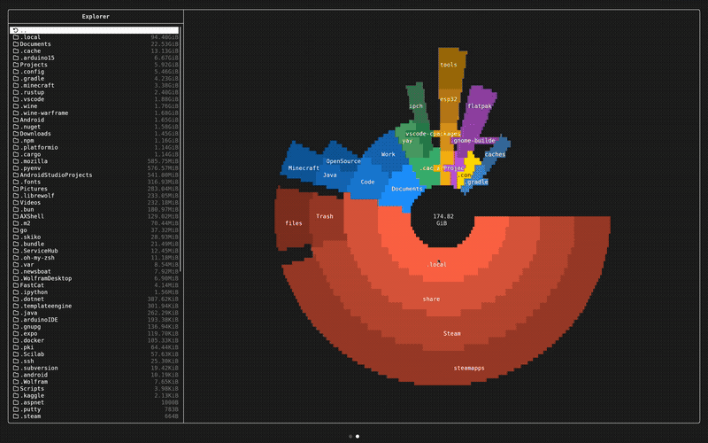

# Bonsai

Bonsai is a terminal user interface (TUI) remake of the GNOME Baobab disk usage analyzer.  
It provides a lightweight, fast, and visually structured way to explore disk usage on Linux systems directly in the terminal.

<p align="center">
  
</p>

## Features

- Navigable sidebar displaying folder sizes, sorted by a scanning algorithm
- Responsive UI
- Pie chart visualization similar to GNOME Baobab:
  - Multiple rings representing nested directories
  - Color-coded sections for files and folders
  - Labels for each item
- Built using **CMake** and **FTXUI** for a modern TUI experience
- Hashmap scan for efficient folder size lookups
- Dynamic pie chart updates when navigating between folders in the sidebar  
- Pie chart highlighting when hovering over folders or files 
- Asynchronous UI rendering
- User customization via configuration file
- Ability to remove files / folders

> [!TIP]
> You can check the scan progress in the top-right corner of your terminal.
> - If a status message is visible → the scanner is still running.
> - If nothing is displayed → the scan has completed.
> - The full pie chart is only displayed when the scanner has completed.

## Planned Features

- Ability to search for folders
- Translations?
- Windows port?

## Dependencies
Before compiling, make sure you have:

- rgb compliant terminal
- cmake and a c compiler
- xxd (usually installed if you have vim)

## Usage

### Keyboard Controls

- `Q` → quit
- `BACKSPACE / ESCAPE` → go up a folder
- `RETURN` → go down a folder
- `UP / DOWN` arrows → navigate menu
- `RIGHT / LEFT` arrows → resize sidebar
- `ESCAPE` → if prompted: exit a modal
- `RETURN` → if prompted: select button in a modal
- `RIGHT / LEFT` arrows → if prompted: navigate modal buttons
- `SUPPR` → delete the selected file / folder

### Mouse Controls
> [!WARNING]
> This app is designed to be keyboard-only, but ftxui does provide some mouse controls

- `SCROLL` → navigate menu
- `LEFT CLICK` → if promted: select button in a modal

## Installation
### Arch Linux (AUR)
You can install Bonsai directly from the AUR:

```bash
# Using an AUR helper like yay
yay -S bonsai

# Using an AUR helper like paru
paru -S bonsai
```

### Other Linux distributions

Build manually from source:
```bash
git clone https://github.com/LittleBigOwI/bonsai.git

cd bonsai
mkdir build

cmake -S . -B build -DCMAKE_BUILD_TYPE=Release
cmake --build build

./build/bonsai
```