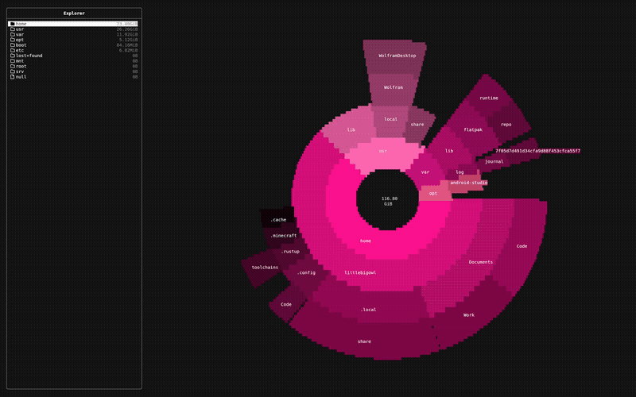

# Bonsai

Bonsai is a terminal user interface (TUI) remake of the GNOME Baobab disk usage analyzer.  
It provides a lightweight, fast, and visually structured way to explore disk usage on Linux systems directly in the terminal.

<p align="center">
  
</p>

## Features

- Navigable sidebar displaying folder sizes, sorted by a multithreaded scanning algorithm
- Pie chart visualization similar to GNOME Baobab:
  - Multiple rings representing nested directories
  - Color-coded sections for files and folders
  - Percentage size usage labels for each item
- Built using **CMake** and **FTXUI** for a modern TUI experience
- Tree and hashmap-based data structure for efficient folder size lookups
- Dynamic pie chart updates when navigating between folders in the sidebar  
- Pie chart highlighting when hovering over folders or files 
- Asynchronous UI rendering before scan completion
- User customization via configuration file

## Planned Features

- Visually better async rendering when scanning disk
- Add ability to remove files / folders

## Installation
### Arch Linux (AUR)
You can install Bonsai directly from the AUR:

```bash
# Using an AUR helper like yay
yay -S bonsai

# Or manually with makepkg
git clone https://aur.archlinux.org/bonsai.git
cd bonsai
makepkg -si
```

### Other Linux distributions
Build manually from source:
```bash
git clone https://github.com/LittleBigOwI/bonsai.git
cd bonsai
mkdir build && cd build
cmake .. && make
./bonsai
```